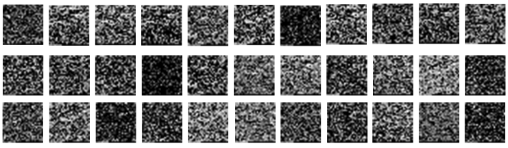

# Image generation from RNA-seq data

This file details the process of making images from RNA-seq data.

## SOM

## Chromosome Location

[Deep Learning Based Tumor Type Classification Using Gene Expression Data](https://doi.org/10.1101/364323) by Lyu and Haque
TCGA - 10267 samples and 20531 genes pertaining to 33 Tumour types
Ordered based on the chromosome number because adjacent genes are more likely to interact with each other.
Matched the genes with an annotation file (removed genes that weren't found)

## Gene Ontology

## DeepInsight

From DeepMapper: _"DeepInsight54 is the most general approach published to date for converting non-image data into image-like structures, with the claim that these processed structures allow CNNs to capture complex patterns and features in the data. DeepInsight offers an algorithm to create images that have similar features collated into a “well organised image form”, or by applying one of several dimensionality reduction algorithms (e.g., t-SNE, PCA or KPCA)54. However, these algorithms add computational complexity, potentially eliminate valuable information, limit the abilities of CNNs to find small perturbations, and make it more difficult to use attribution to determine most notable features impacting analysis as multiple features may overlap in the transformed image. In contrast DeepMapper uses a direct mapping mechanism where each feature corresponds to one pixel."_

Later developed DeepFeature for associating image areas to input variable through attribution methods.

## DeepMapper

_"DeepMapper uses a much simpler and faster algorithm, while DeepInsight chooses a sophisticated set of algorithms to convert non-image data to images, dramatically increasing computational cost. The DeepInsight conversion process is not designed to utilise GPUs so cannot be accelerated by better hardware, and the obtained images may be larger than the number of data points, also impacting performance."_
